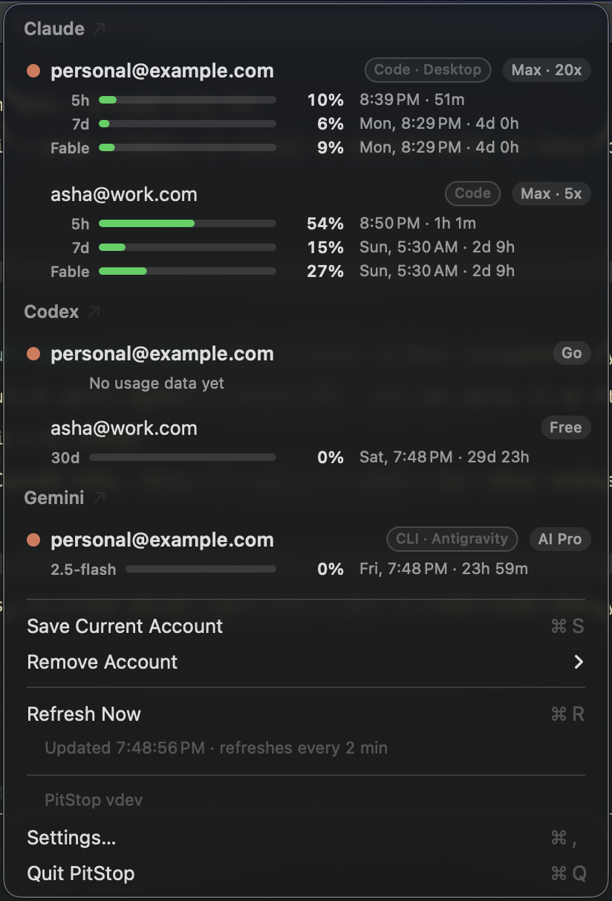

<p align="center">
  
</p>

# PitStop

macOS menu bar app that tracks **usage limits** across your AI coding accounts
— **Claude Code**, **Claude Desktop**, **OpenAI Codex**, and **Google Gemini**
(CLI + Antigravity) — and lets you **switch accounts** with one click, so when
one hits its rate limit you flip to another and your work keeps going.

<p align="center">
  
</p>

Accounts are grouped into a section per provider — **Claude**, **Codex**, and
**Gemini**. Within each section the live account is marked with a
coral dot and listed first, then the rest by headroom (emptiest next — the one
you'd switch to). Hovering a switchable row flips its plan chip into a coral
**Switch** pill. A small tag on each row names the surface — **Code**,
**Desktop**, or **Code · Desktop** — so you can tell a switchable CLI account
from a read-only Desktop one at a glance. The menu bar shows the active Claude
Code account's binding limit, color-coded.

What shows up where:

- **Claude Code** accounts are switchable. **Claude Desktop** (a *different*
  login) shows read-only, tagged **Desktop**; an account signed into both Code
  and Desktop is one shared usage pool, so it stays a single row tagged
  **Code · Desktop**.
- **OpenAI Codex** accounts are switchable too — its login lives in
  `~/.codex/auth.json` (shared by the Codex CLI and the Codex app), which
  PitStop snapshots per account and swaps the same way it swaps the Claude
  Code credential. Each plan's rate-limit windows render as bars just like
  Claude's 5-hour and weekly limits.
- **Google Gemini** accounts are switchable as well. The `gemini` CLI and the
  Antigravity editor authenticate the same Google account, so they merge into
  one row — tagged **CLI**, **Antigravity**, or **CLI · Antigravity** — with a
  bar for the most-used model's daily quota and a compact line for the
  runners-up.

## Quickstart

Using an AI agent? Copy this prompt into Claude Code (or any agent that can
run shell commands) on the target Mac:

```text
Install and set up PitStop (https://github.com/Livin21/pitstop), a macOS
menu bar app that tracks usage limits and switches accounts across Claude
Code, Claude Desktop, OpenAI Codex, and Google Gemini, on this Mac.

1. Verify requirements: macOS 26+, Xcode Command Line Tools
   (xcode-select --install), and Claude Code installed and logged in.
   Stop and tell me if any are missing.
2. Clone the repo and run ./scripts/make-app.sh — it builds and installs
   /Applications/PitStop.app. Then `open /Applications/PitStop.app`.
3. You cannot interact with macOS security dialogs — walk me through
   them instead: when PitStop first reads the Claude Code credentials,
   macOS may ask for my login keychain password. I'll enter it and click
   "Always Allow" (plain "Allow" makes the prompt come back). The grant
   is one-time; it survives rebuilds. If I use the Claude Desktop app too,
   a second identical prompt may appear for "Claude Safe Storage" (so
   PitStop can show that account's usage) — same deal, Always Allow.
4. Verify: a checkered-flag icon appears in the menu bar showing my
   usage percentage, and `.build/release/PitStop --check` prints my
   account with live usage numbers.
5. Tell me how to add a second account: run /login in Claude Code and
   sign in with the other account — PitStop saves it within 2 minutes
   (or via "Save Current Account" in the menu). I'll also click "Allow"
   on the notification prompt the first time it warns about usage.
6. If I also use OpenAI Codex, Google Gemini (CLI or Antigravity), or the
   Claude Desktop app, tell me they're detected automatically and show up
   in their own menu sections — Codex and Gemini accounts are switchable
   like Claude Code (Codex reads ~/.codex/auth.json with no prompt; Gemini
   reads ~/.gemini files, and Antigravity's keychain item is one more
   one-time Always Allow grant), Claude Desktop is read-only.
```

Or set it up manually:

1. Requirements: **macOS 26+**, Xcode Command Line Tools, and Claude Code
   logged in at least once.
2. Build and install:
   ```sh
   git clone https://github.com/Livin21/pitstop && cd pitstop
   ./scripts/make-app.sh
   open /Applications/PitStop.app
   ```
3. When macOS asks for your login keychain password, enter it and click
   **Always Allow** — one-time; see [Caveats](#caveats).
4. Add more accounts per [Adding a second account](#adding-a-second-account).

## How it works

- **Usage** comes from Anthropic's OAuth usage endpoint
  (`api.anthropic.com/api/oauth/usage`), called with the same OAuth token
  Claude Code uses. Refreshes every 2 min (debounced on menu open), with
  exponential backoff honoring `Retry-After` when Anthropic rate-limits,
  retrying as soon as the backoff window expires; the last good numbers
  stay visible (rows note "showing … data"; the menu bar dims) during
  outages — and across relaunches: display state (bars, errors, retry
  backoffs) persists to `~/.config/pitstop/usage-cache.json`, so a launch
  that lands mid-rate-limit shows your last-known numbers instead of a
  blank menu.
- **Menu bar number** is, by default, the active Claude Code account's
  binding constraint — `max(5-hour, weekly, per-model)` utilization (per-model
  weekly limits like Fable render as their own labelled bars) — with a warning
  dot from 75 % (🟠) and 90 % (🔴). (Dots rather than colored text: macOS
  repaints menu bar items in a single wallpaper-matched ink, and emoji are the
  only glyphs that keep their color.) **Settings** customizes it: what it shows
  (icon & percent / icon only / percent only), which account it tracks (the
  active Claude Code account, or the most-used account across any provider),
  and which limit drives the number (highest / 5-hour / weekly).
- **Auto-switch** (off by default) flips a switchable provider's live account
  — Claude Code, Codex, or Gemini — to the saved account with the most
  headroom once the live one crosses a configurable threshold, and notifies
  you. Checkboxes pick which limit kinds count — 5-hour, weekly, per-model
  (Fable, Gemini quotas) — for both the trigger and the target ranking. It
  only moves onto accounts with trustworthy fresh data, and a per-provider
  cooldown prevents flapping; Desktop is read-only and left alone.
- **Session warming** (off by default) starts a 5-hour session on every
  saved Claude account whenever none is running during your configured
  hours (default 6 AM–6 PM), so limit resets land inside your day instead
  of at its end. Costs about one token per account per session; caps are
  unaffected — it only chooses when the session clock starts.
- **Time-to-limit projection** (on by default) samples usage over time and,
  when a window is trending toward full *before* it resets, shows
  "↗ on pace to hit limit ~3:40 PM" on the row.
- **Notifications** fire when the active account crosses 80 % and 95 %,
  with the reset time, so you can switch before sessions stall.
- **Settings** (⌘, from the menu) is a small window holding all preferences —
  the menu-bar options above, auto-switch and its per-limit trigger
  checkboxes, session warming and its hours, the projection toggle, and
  launch at login.
- **Accounts** are snapshots of the Claude Code credential blob:
  - secrets live in the **keychain** (service `PitStop-profile`, one item
    per account email) — never written to disk;
  - non-secret identity (email, org, plan) lives in
    `~/.config/pitstop/profiles.json`.
- **Claude Desktop** (the chat app) is read separately and read-only. It
  signs into claude.ai with a cookie session rather than the OAuth token
  Claude Code uses, so PitStop decrypts that app's `sessionKey` cookie
  (Chromium AES, keyed by the `Claude Safe Storage` keychain item, read
  through the same `security` path) and calls claude.ai's usage endpoint —
  which happens to return the same shape as the OAuth one. PitStop never
  writes to Claude Desktop's data; you can't switch a Desktop account from
  PitStop (its login lives in that app).
- **OpenAI Codex** uses `~/.codex/auth.json` — the ChatGPT OAuth token the
  Codex CLI and Codex app both use — for both identity and switching. Usage
  comes from `chatgpt.com/backend-api/codex/usage`, a cheap metadata call
  returning each rate-limit window's used-percent and reset time. Switching is
  the file analog of the Claude flow: PitStop snapshots the live `auth.json`
  per account into the keychain (service `PitStop-codex`) and, on switch,
  writes the chosen account's snapshot back into the file (compacted — JSON is
  whitespace-insensitive, and `security` mangles multi-line secrets). Inactive
  snapshots whose access token has aged out are refreshed via the ChatGPT
  OAuth refresh grant (against Codex's public client) and the rotated tokens
  stored back, so an inactive account shows live usage and a switch into it
  lands a fresh token — the *live* account is left to Codex, which keeps it
  fresh itself. The CLI and app share one login, so each Codex account is one
  row. Per-account state is keyed by provider, so a Claude account and a Codex
  account that happen to share an email stay distinct rows.
- **Google Gemini** covers two surfaces with one Google login: the `gemini`
  CLI keeps its OAuth credential in `~/.gemini/oauth_creds.json` (active
  account in `google_accounts.json`), Antigravity keeps a go-keyring blob in
  the keychain (item `gemini`/`antigravity`). Identity and plan come from
  Google's Code Assist backend (`cloudcode-pa.googleapis.com` —
  `loadCodeAssist`); usage comes from `retrieveUserQuota`, each model's
  remaining daily quota. Switching mirrors the other providers: snapshots
  live in the keychain (services `PitStop-gemini-cli` /
  `PitStop-gemini-antigravity`, one item per email), and a switch writes the
  chosen account's blobs back into the CLI files and/or the Antigravity
  keychain item — whichever surfaces that account was saved from. Inactive
  snapshots are kept fresh via Google's OAuth refresh grant, like Codex's.
- **All keychain access goes through `/usr/bin/security`** — the same CLI
  Claude Code shells out to. One "Always Allow" grant (enter the keychain
  password when prompted) covers both apps and survives PitStop rebuilds,
  since the requester is the stable Apple-signed `security` binary rather
  than the re-signed app bundle. Trade-off: writes pass the blob via argv
  (briefly visible in the process list) — same exposure Claude Code has.
- **Switching a Claude account** writes its blob back into the live
  `Claude Code-credentials` keychain item and restores its `oauthAccount`
  identity in `~/.claude.json`. The whole blob is swapped, so per-account MCP
  OAuth tokens (e.g. Atlassian) move with it. (Codex switching is the file
  analog — see the Codex bullet above.)
- **Stale tokens** of saved (inactive) Claude accounts are refreshed
  automatically via the standard OAuth refresh grant against Claude Code's
  public client, and the refreshed tokens are stored back. The *active*
  account is never refreshed by PitStop — Claude Code keeps it fresh itself
  (PitStop only steps in as a fallback if it finds the live token already
  expired).

## Adding a second account

PitStop can only switch between accounts it has snapshotted, and it snapshots
whatever is *live* on each refresh — so seed each account by being logged into
it once while PitStop runs:

1. PitStop auto-saves whatever account is currently live.
2. Sign in with the **other** account — Claude Code: run `/login`; Codex: run
   `codex` and sign in (the CLI and the Codex app share this login); Gemini:
   sign in from the `gemini` CLI or Antigravity (both share the Google login).
3. PitStop notices it on the next refresh and saves it too (for Claude you can
   also click **Save Current Account**).
4. Both accounts now appear in the menu — click either to switch.

## What switching means for running sessions

After a switch, the live credential (Claude Code's keychain item, or Codex's
`~/.codex/auth.json`) points at the new account:

- **New sessions** use the new account immediately.
- **Running Claude Code sessions** keep working on the old in-memory token
  until it expires (tokens are short-lived), then re-read the keychain — no
  restarts.
- **The Codex app**, if open, may need a quit-and-reopen to pick up the swap
  (and can overwrite `auth.json` from memory while running — switch Codex with
  the app closed for a clean result).
- **Gemini** surfaces re-read their credential stores on their own cadence —
  new CLI sessions pick the swap up immediately; a running Antigravity may
  need a restart to notice.

## Development

`./scripts/make-app.sh` builds release and installs
`/Applications/PitStop.app`. Useful flags on the bare binary:

- `--check` — print accounts and live usage to stdout, no GUI.
- `--preview` — render sample account rows to `/tmp/pitstop-preview.png`
  for iterating on the row design.
- `--screenshot` — run the app with sample addresses in place of real
  emails, for README captures.

The app icon (usage gauge with a coral needle nearing the red zone, over a
checkered pit-lane strip) is drawn programmatically — regenerate
`Resources/AppIcon.icns` after design tweaks with:

```sh
swift scripts/make-icon.swift
```

## Changelog

See [CHANGELOG.md](CHANGELOG.md) for release history (also published on
[GitHub Releases](https://github.com/Livin21/pitstop/releases)).

## Contributing

Contributions are welcome — see [CONTRIBUTING.md](CONTRIBUTING.md) for build
steps, style, and how to add a provider. Please open an issue before anything
non-trivial. Because PitStop handles live credentials, report security issues
**privately** per the [security policy](SECURITY.md), not as a public issue. By
participating you agree to the [Code of Conduct](CODE_OF_CONDUCT.md).

### Caveats

- Keychain prompts are **one-time per item**: when `security` first touches
  an item it isn't yet allowed on, macOS asks for the login keychain
  password — enter it and click **Always Allow** (plain "Allow" grants once
  and the prompt returns). Because access rides the Apple-signed `security`
  CLI, rebuilds of PitStop do **not** re-trigger prompts.
- `~/.claude.json` is rewritten on switch (only the `oauthAccount` key is
  changed, but the file is re-serialized). Claude Code rewrites this file
  constantly itself; a concurrent write race is theoretically possible but
  the window is milliseconds.
- **Claude Desktop** support adds one more one-time keychain grant: the first
  time PitStop reads the `Claude Safe Storage` item (to decrypt that app's
  session cookie), macOS prompts — enter the password and click **Always
  Allow**, same as the credentials grant. It reads claude.ai's unofficial web
  endpoints with the desktop app's own session; if those change, update
  `ClaudeDesktop.swift`. If Claude Desktop isn't installed or isn't signed
  in, nothing changes.
- **Codex** keeps inactive snapshots fresh via the OAuth refresh grant, but
  the *live* account is Codex's to maintain — PitStop never rewrites the live
  `auth.json` on a refresh cycle. So if the live account's token is expired
  (e.g. right after switching into an account whose snapshot was stale), its
  row says "run codex to refresh" — running `codex` (or any use) refreshes it.
  An inactive account only shows "sign in to Codex again" if its refresh token
  is itself dead. Reading `auth.json` needs no keychain prompt (it's a plain
  file); saving/refreshing snapshots creates `PitStop-codex` keychain items the
  same silent way as the Claude ones. It reads ChatGPT's unofficial backend and
  OAuth endpoints; if those change, update `Codex.swift`. Not installed or not
  signed in → nothing changes.
- **Gemini** reads the CLI's plain credential files (no prompt) and
  Antigravity's `gemini` keychain item — one more one-time **Always Allow**
  grant, same as the others. It talks to Google's unofficial Code Assist
  endpoints; if those change, update `Gemini.swift`. Not installed or not
  signed in → nothing changes.
- The usage endpoint and refresh flow are the same unofficial OAuth surface
  Claude Code itself uses; if Anthropic changes them, update `UsageAPI.swift`.
